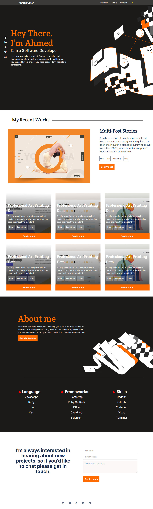

# My Portfolio
It's my portfolio. Here you will find my projects and experience

Take a look now!

# Build With
 - HTML
 - CSS
 - Webhint
 - Stylelint
 
# Getting Started
 1) open command line
 2) write "git clone https://github.com/Ahmed-Alfaouq/My-Portfolio.git"
 3) Enjoy
 
 Or
 1) Click on code tab
 2) Double click on index.html
 3) Enjoy
# Dome
[Live Demo](https://ahmed-alfaouq.github.io/My-Portfolio/)
# Prerequisites
 You need some coding knowldge
 
# Setup
 1) open command line
 2) write "git clone https://github.com/Ahmed-Alfaouq/My-Portfolio.git"
 3) Enjoy

# Authors
 :bearded_person: **Ahmed Omar**
  - Github: [@Ahmed-Alfarouq](https://github.com/Ahmed-Alfaouq)
  - LinkedIn: [LinkedIn](https://www.linkedin.com/in/ahmed-omar912ba9199/)
  - Twitter: [@twitter](https://twitter.com/mediocre23534)

# :handshake: Contributing
Contributions, issues, and feature requests are welcome!
Feel free to check the issues page.
